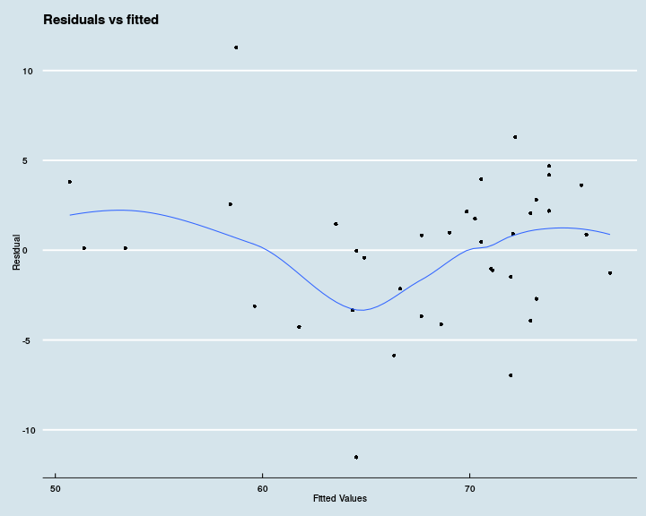

We read the data using the following command

```r
tele <- read.csv("/data/Ulm/Teaching/SS_2014/Intro_Biostat_Comp/Illustrations/Television/data/television.csv", 
                 stringsAsFactors = FALSE, na.strings = "*")
head(tele)
```

```
##      Country life    tv phys fem male
## 1  Argentina 70.5   4.0  370  74   67
## 2 Bangladesh 53.5 315.0 6166  53   54
## 3     Brazil 65.0   4.0  684  68   62
## 4     Canada 76.5   1.7  449  80   73
## 5      China 70.0   8.0  643  72   68
## 6   Colombia 71.0   5.6 1551  74   68
```

The aim of the analysis is to assess whether there exists a relation
between the number of people per television set and life
expectancy. 

We first note a couple of facts:

- Japan is the country with the highest
  life expectancy while Ethiopia has the
  lowest;
  
- "Unsurprisingly", the United States
  have the lower number of habitants per television set and is equal
  to 1.3.

We will first explore the data graphically in
[Section 1][Graphical exploration] and perform a simple analysis in
[Section 2][Linear model].

## Graphical exploration

We first display a scatterplot of `life` and `tv`. A trend is clearly
to be seen but is non-linear.


```r
ggplot(tele, aes(x = tv, y = life)) +
  geom_jitter(size =3) +
  geom_smooth(method = "lm") +
  theme_economist()
```

```
## Warning: Removed 2 rows containing missing values (stat_smooth).
```

```
## Warning: Removed 2 rows containing missing values (geom_point).
```


We first display a scatterplot of `life` and `tv`. A trend is clearly
to be seen but is non-linear.

As a second step, we log-transform the variable `tv`. The relation
between life expectancy and log televisions is in the next figure.
The transformation leads to an (almost) perfect linear
relation between these two variables. 

```r
tele$log_tv <- log(tele$tv)
ggplot(tele, aes(x = log_tv, y = life)) +
  geom_jitter(size =3) +
  geom_smooth(method = "lm") +
  theme_economist()
```

```
## Warning: Removed 2 rows containing missing values (stat_smooth).
```

```
## Warning: Removed 2 rows containing missing values (geom_point).
```


## Linear model

We fit a linear model with life expectancy as outcome and the
log-transformed number of individuals per television set.


```r
fit_lm <- lm(life ~ log(tv), tele)
```
The results are displayed below

```r
out <- summary(fit_lm)$coefficients
out[, 1:3] <- round(out[, 1:3], 2)
out[, 4] <- format.pval(out[, 4], digits = 2,
                        eps = 10^(-3))

print(xtable(out),
      caption.placement = "top", type = "html")
```

<!-- html table generated in R 3.2.0 by xtable 1.7-4 package -->
<!-- Thu Apr 30 11:53:22 2015 -->
<table border=1>
<tr> <th>  </th> <th> Estimate </th> <th> Std. Error </th> <th> t value </th> <th> Pr(&gt;|t|) </th>  </tr>
  <tr> <td align="right"> (Intercept) </td> <td> 77.89 </td> <td> 1.22 </td> <td> 63.83 </td> <td> &lt;0.001 </td> </tr>
  <tr> <td align="right"> log(tv) </td> <td> -4.26 </td> <td> 0.43 </td> <td> -9.9 </td> <td> &lt;0.001 </td> </tr>
   </table>
We can check the model fit by plotting the residuals versus the fitted
values.

```r
df <- fortify(fit_lm)
ggplot(df, aes(.fitted, .resid)) +
  geom_point(size = 2)  +
  geom_smooth(se=FALSE) +
  scale_x_continuous("Fitted Values") +
  scale_y_continuous("Residual") +
  labs(title = "Residuals vs fitted") +
  theme_economist()
```

```
## geom_smooth: method="auto" and size of largest group is <1000, so using loess. Use 'method = x' to change the smoothing method.
```


