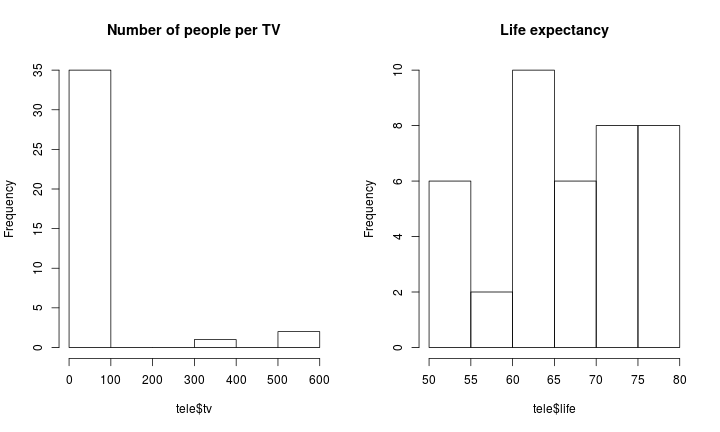

An analysis of the television data set
===========================================


We read the data using the follwing commands

```r
tele <- read.csv("/data/Ulm/Teaching/SS_2014/Intro_Biostat_Comp/Illustrations/Television/data/television.csv", 
                 stringsAsFactors = FALSE, na.strings = "*")
```
and an excerpt of the data are displayed below.

```r
head(tele)
```

```
##      Country life    tv phys fem male
## 1  Argentina 70.5   4.0  370  74   67
## 2 Bangladesh 53.5 315.0 6166  53   54
## 3     Brazil 65.0   4.0  684  68   62
## 4     Canada 76.5   1.7  449  80   73
## 5      China 70.0   8.0  643  72   68
## 6   Colombia 71.0   5.6 1551  74   68
```
`Country` is the country name, `life` is the life expectancy at birth, while `tv` and `phys`
are the number of people of television set and the number of people per physicians, respectively.


```r
oldpar <- par(no.readonly = TRUE)
par(mfrow = c(1, 2))
hist(tele$tv, main = "Number of people per TV")
hist(tele$life, main = "Life expectancy")
par(oldpar)
```

 

## rrhasdfgsdf

### ksfdklfjsdklf
