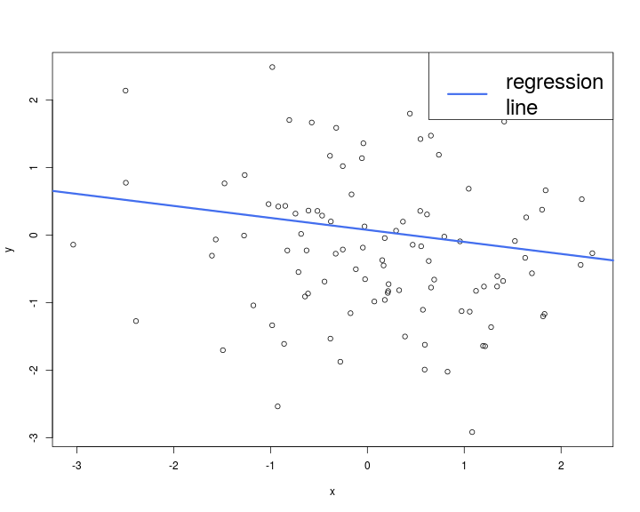

% (Quick) Introduction to R
% Arthur Allignol


What is R?
==================================================

- R is *an environment for statistical computing and graphics*
	- free software (GPL license)
	- Available for Linux, Solaris, Windows, Mac OSX

- Derived from the S language
  
- http://www.r-project.org/

- The strength of R is its community
	- $\geq$ 6000 packages additional packages implementating the latest
      statistical techniques
	- http://cran.r-project.org/

What is R?
========================================

- R is an interactive language
	- Statements converted to machine instructions as they are
      encountered
	- Flexible but slower than compiled code

- R provides excellent graphics functionality (base graphics and
  additional packages)

- Can be used both as a glorified calculator or as a "real"
  programming language


R as a calculator
========================================


```r
1 + 1
```

```
[1] 2
```

```r
2 + 3 * 4
```

```
[1] 14
```

```r
sqrt(9)
```

```
[1] 3
```

```r
pi
```

```
[1] 3.141593
```


R as a smart calculator
=======================================


```r
x <- 5            #allocate value to an object
x <- 5            #as above
print(x)          # objects in console
```

```
[1] 5
```

```r
x                 #same
```

```
[1] 5
```

```r
a <- sqrt(81)     #square root
b <- exp(2)       #exponential function
c <- log(50)      #logarithm
a * b + c         #basic operations
```

```
[1] 70.41353
```


Getting help
========================================
	
- At the R prompt

```r
help("fun")
?fun
```

- The **sos** package (see next slide for installing packages) and the `findfn` function

- On the internet
	- [R mailing list](https://stat.ethz.ch/mailman/listinfo/r-help)
	- [stackoverflow](http://stackoverflow.com/)
	- [Cross Validated](http://stats.stackexchange.com/)


# Vector operations


```r
# define vector by means of the
# specification of its single elements
W <- c(1,2,3,5,9,7)  
W
```

```
[1] 1 2 3 5 9 7
```

```r
# vector with a 3 (repeated 5 times)
X <- rep(3,5)        
X
```

```
[1] 3 3 3 3 3
```

```r
# combine vectors 
A <- c(W,X)
A
```

```
 [1] 1 2 3 5 9 7 3 3 3 3 3
```

# Vector operations


```r
# vector with values from 1 to 10 with stepsize 2
Y <- seq(0,10,2)     
Y
```

```
[1]  0  2  4  6  8 10
```

```r
#equals seq(0,10,1)
Z <- 0:10            
Z
```

```
 [1]  0  1  2  3  4  5  6  7  8  9 10
```

```r
# element-wise addition
W+Y
```

```
[1]  1  4  7 11 17 17
```

```r
# element-wise multiplication
W*Y
```

```
[1]  0  4 12 30 72 70
```

```r
# element-wise multiplication with a scalar
5*W               
```

```
[1]  5 10 15 25 45 35
```

# Vector operations


```r
length(W)         #determine length of vector
```

```
[1] 6
```

```r
t(W)%*%Y          #transposition and vector multiplication
```

```
     [,1]
[1,]  188
```

```r
W[4]              #select specific element
```

```
[1] 5
```

# Vector operations

```r
W[W>2]
```

```
[1] 3 5 9 7
```

```r
W[W>2 & W<7]
```

```
[1] 3 5
```

```r
which(W>2)        #determine indices where a condition holds
```

```
[1] 3 4 5 6
```

# Matrix operations


```r
A=matrix(0,nrow=2,ncol=3)   #Initialize 2x3 matrix including 0
A
```

```
     [,1] [,2] [,3]
[1,]    0    0    0
[2,]    0    0    0
```

```r
A[1,3]=5          #allocate single value at position (1,3)
A
```

```
     [,1] [,2] [,3]
[1,]    0    0    5
[2,]    0    0    0
```

```r
A[,2]=c(1,2)      #allocate values to a whole column (analogously with rows)
A
```

```
     [,1] [,2] [,3]
[1,]    0    1    5
[2,]    0    2    0
```

# Matrix operations

```r
A[-3]             # A without the third element
```

```
[1] 0 0 2 5 0
```

```r
B=matrix(c(1,1,1,2,2,2,3,3,3),3,3) #Initialize matrix with single values
B
```

```
     [,1] [,2] [,3]
[1,]    1    2    3
[2,]    1    2    3
[3,]    1    2    3
```

```r
C=diag(c(1,2,3))  #diagonal matrix
C         
```

```
     [,1] [,2] [,3]
[1,]    1    0    0
[2,]    0    2    0
[3,]    0    0    3
```

# Matrix operations

```r
B * C               #element-wise operations
```

```
     [,1] [,2] [,3]
[1,]    1    0    0
[2,]    0    4    0
[3,]    0    0    9
```

```r
B + C
```

```
     [,1] [,2] [,3]
[1,]    2    2    3
[2,]    1    4    3
[3,]    1    2    6
```

```r
B %*% C             # matrix multiplication
```

```
     [,1] [,2] [,3]
[1,]    1    4    9
[2,]    1    4    9
[3,]    1    4    9
```

# Matrix operations

```r
A
```

```
     [,1] [,2] [,3]
[1,]    0    1    5
[2,]    0    2    0
```

```r
(A <- rbind(A, c(0, 1, 5))) #add row
```

```
     [,1] [,2] [,3]
[1,]    0    1    5
[2,]    0    2    0
[3,]    0    1    5
```

```r
(A <- cbind(A, c(0, 1, 4))) #add column
```

```
     [,1] [,2] [,3] [,4]
[1,]    0    1    5    0
[2,]    0    2    0    1
[3,]    0    1    5    4
```

# Control flow

- `for` loops

```r
for (i in 1:3) {
    print(i)
}
```

```
[1] 1
[1] 2
[1] 3
```

```r
item <- c("Apple", "Orange", "Tomato")
for (i in item)
    print(i)
```

```
[1] "Apple"
[1] "Orange"
[1] "Tomato"
```

# Control flow

- `while` loop


```r
i <- 5
while(i < 10){      
    print(i)
    i <- i + 1
}
```

```
[1] 5
[1] 6
[1] 7
[1] 8
[1] 9
```

# Control flow

- `if-then-else`


```r
x <- 8
y <- 7
if (x < y) {          
    print(x)
} else {
      print(y)
  }
```

```
[1] 7
```

# Control flow
- `ifelse()`

```r
(z <- ifelse(x < y, x, y))
```

```
[1] 7
```

- `ifelse` works with vectors


```r
a <- c(3, 7, 8)
b <- c(4, 6, 9)
ifelse(a < b, a, b)
```

```
[1] 3 6 8
```

# Distributions

- Normal distribution


```r
# Value of a N(5,34) density function of at point x=2
dnorm(x=2, mean = 5, sd = 7)     
```

```
[1] 0.05199096
```

```r
# Value of a N(0,1) distribution function at point x=2   
pnorm(q=2, mean = 0, sd = 1)     
```

```
[1] 0.9772499
```

```r
# p-quantile of a N(0,1) distribution
qnorm(p=0.25, mean = 0, sd = 1)  
```

```
[1] -0.6744898
```

```r
# Simulation of 50 N(0,1)-distributed random variables
x <- rnorm(n=50, mean = 0, sd = 1)  
```

# Distributions

- Other distributions

```r
rexp(n = 5, rate = 1)   # exponential distribution
```

```
[1] 4.5224090 0.4065422 0.1168759 0.3278900 1.3803991
```

```r
punif(1.5, 1, 2)      # Uniform distribution [1,2]
```

```
[1] 0.5
```

See the
[distribution help page](https://stat.ethz.ch/R-manual/R-devel/library/stats/html/Distributions.html)
and the
[Distribution task view](http://cran.r-project.org/web/views/Distributions.html)
for all distributions available

# Some math functions


```r
x <- abs(rnorm(50, 2, 2)) #abs: absolute value

sqrt(x)    #square root
exp(x)     #exponential function
log(x)     #logarithm
sin(x)     #sinus
cos(x)     #cosinus
sort(x)    #sort entries
quantile(x,0.25)  #sample 25%-quantile

mean(x)    #sample mean
var(x)     #sample variance
sd(x)      #sample standard deviation
sqrt(var(x))
median(x)  #sample median
min(x)     #sample minimum
max(x)     #sample maximum
summary(x) #Overview of important sample parameters
```

# User defines functions

- A function with one parameter

```r
myFun <- function(x) {
    x^2 + 1
}
myFun(3)
```

```
[1] 10
```

# User defined functions
- A function with more parameters

```r
complicated_function <- function(x, y = 2, text = "apple") {
    length_text <- nchar(text)
    if (y > 0) {
        res <- x + log(y) * length(text)
    } else {
          res <- x + log(abs(y)) * length(text)
      }

    res
}
```

# User defined function


```r
(a <- complicated_function(x = 10))
```

```
[1] 10.69315
```

```r
(b <- complicated_function(10, -2, "fffff"))
```

```
[1] 10.69315
```

- [Careful](http://cran.r-project.org/doc/FAQ/R-FAQ.html#Why-doesn_0027t-R-think-these-numbers-are-equal_003f)
  with floating points


```r
a <- sqrt(2)
a * a - 2
```

```
[1] 4.440892e-16
```

```r
a * a == 2
```

```
[1] FALSE
```

# Data frames


```r
x <- c("Franz", "Anton", "Heinrich")                   
y <- c(1.0, 1.7, 2.7)
z <- c(95, 85, 67)
grades_list = data.frame(name=x, grade=y, points=z)                             #create Data Frame
grades_list
```

```
      name grade points
1    Franz   1.0     95
2    Anton   1.7     85
3 Heinrich   2.7     67
```

```r
# add a row
(grades_list <- rbind(grades_list,
                     data.frame(name= "Maria", grade = 3.7, points = 54)) )
```

```
      name grade points
1    Franz   1.0     95
2    Anton   1.7     85
3 Heinrich   2.7     67
4    Maria   3.7     54
```

# Data frames


```r
# create new gender vector
gender <- c(rep("m", 3), "f")
grades_list <- cbind(grades_list, gender) #add column
grades_list
```

```
      name grade points gender
1    Franz   1.0     95      m
2    Anton   1.7     85      m
3 Heinrich   2.7     67      m
4    Maria   3.7     54      f
```

# Data frames

- Column access

```r
grades_list$points
```

```
[1] 95 85 67 54
```

```r
grades_list[, "points"]
```

```
[1] 95 85 67 54
```

```r
grades_list[, 3]
```

```
[1] 95 85 67 54
```

```r
grades_list[[3]]
```

```
[1] 95 85 67 54
```

# Data frames


```r
# determine mean grade of all male individuals
x <- subset(grades_list, gender == "m")$grade
# equivalently
y <- grades_list[grades_list$gender == "m", "grade"]
mean(x) == mean(y)
```

```
[1] TRUE
```

# Graphics


```r
x <- rnorm(100)
y <- rnorm(100)
plot(x, y, col = 1)
abline(lm(x~y), lwd = 3, col = "royalblue2")
legend("topright", "regression\nline", col = "royalblue2", lwd = 3, cex = 2)
```



# Graphics


```r
hist(x)
```


