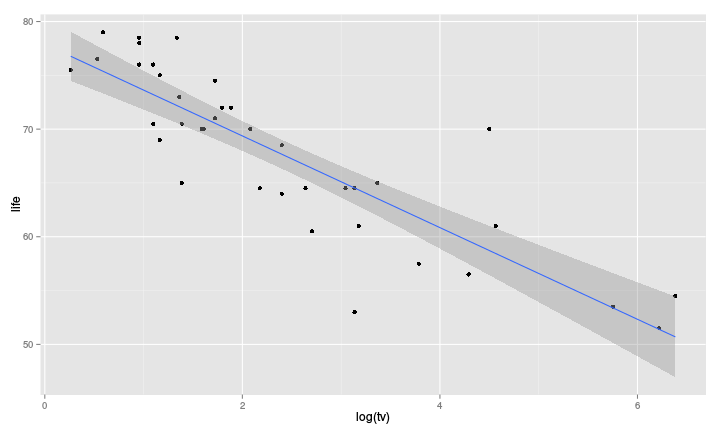

# Markdown basics

## Introduction

- Simple formating language
- Syntax close to plain text email, e.g
- `pandoc` is then used to transform the markdown file into
  the required format

```{markdown}
# Simple Example

This is a very simple document; here is word in *italics*,
or in **bold**.

Lists are also easily created, e.g.,
- item 1
- item 2
- item 3

`in-line code` is obtained with a back-tick.

The following

a header | a second header
---------|----------------
cell 1   | cell 2
cell 3   | cell 4

is a table

```


## Simple Example

This is a very simple document; here is word in *italics*,
or in **bold**.

Lists are also easily created, e.g.,

- item 1  
- item 2  
- item 3  
	
`in-line code` is obtained with a back-tick.

The following

a header | a second header
---------|----------------
cell 1   | cell 2
cell 3   | cell 4

is a table


# Markdown syntax

## Headers

```{markdown}
# Header 1

## Header 2

### Header 3
```

## Lists

- Unordered lists

```{markdown}
- Item 1
- Item 2
    + Item 2a
    + Item 2b
```

- Ordered lists

```{markdown}
1. Item 1
2. Item 2
3. Item 3
    + Item 3a
    + Item 3b
```

## Links and Images

- Links
```{markdown}
http://www.uni-ulm.de/mawi/statistics.html
[Our institute](http://www.uni-ulm.de/mawi/statistics.html)
```
	http://www.uni-ulm.de/mawi/statistics.html

	[Our institute](http://www.uni-ulm.de/mawi/statistics.html)

- Images
	- Local file
	```
	
	```
	- On the internet
	```
	
	```

## Equations

- Inline equation  
```{latex}
$Y = \beta_0 + \sum_{i = 1}^p \beta_i Z_i$
```
which gives $Y = \beta_0 + \sum_{i = 1}^p \beta_i Z_i$

- Display equations  
```{latex}
$$Y = \beta_0 + \sum_{i = 1}^p \beta_i Z_i$$
```
which gives $$Y = \beta_0 + \sum_{i = 1}^p \beta_i Z_i$$


# R code Chunks

## Basic usage

- Code chunks are delimited with
  

        ```{r }
        a <- 1
        ```

- A chunk name can be given as well as options
```
{r chunk_name, options}
```

- Compiling:
	- in Rstudio, just click
	- in R use the `knit()` function

# Figures and Tables

## Tables


```r
fit_lm <- lm(life ~ log(phys) + log(tv), data = tele)
```

- `kable()` function in **knitr**

        ```{r , results = "asis"}
        kable(summary(fit_lm)$coefficients,
              digits = 2)
        ```


|            | Estimate| Std. Error| t value| Pr(>&#124;t&#124;)|
|:-----------|--------:|----------:|-------:|------------------:|
|(Intercept) |    90.62|       4.36|   20.81|                  0|
|log(phys)   |    -2.26|       0.75|   -3.02|                  0|
|log(tv)     |    -2.92|       0.59|   -4.94|                  0|

## Tables 


```r
out <- summary(fit_lm)$coefficients
out[, 1:3] <- round(out[, 1:3], 2)
out[, 4] <- format.pval(out[, 4], digits = 2,
                        eps = 10^(-3))
kable(out)
```


|            |Estimate |Std. Error |t value |Pr(>&#124;t&#124;) |
|:-----------|:--------|:----------|:-------|:------------------|
|(Intercept) |90.62    |4.36       |20.81   |<0.001             |
|log(phys)   |-2.26    |0.75       |-3.02   |0.0047             |
|log(tv)     |-2.92    |0.59       |-4.94   |<0.001             |

## Tables

### Using the **pander** package


```r
library(pander)
## A method to work directly with regression models objects
pander(summary(fit_lm), style = "grid")
```


+-------------------+------------+--------------+-----------+------------+
|      &nbsp;       |  Estimate  |  Std. Error  |  t value  |  Pr(>|t|)  |
+===================+============+==============+===========+============+
|   **log(phys)**   |   -2.259   |    0.7474    |  -3.022   |  0.004672  |
+-------------------+------------+--------------+-----------+------------+
|    **log(tv)**    |   -2.916   |    0.5907    |  -4.936   | 1.947e-05  |
+-------------------+------------+--------------+-----------+------------+
|  **(Intercept)**  |   90.62    |    4.356     |   20.81   | 2.733e-21  |
+-------------------+------------+--------------+-----------+------------+


-------------------------------------------------------------
 Observations   Residual Std. Error   $R^2$   Adjusted $R^2$ 
-------------- --------------------- ------- ----------------
      38               3.704         0.7868       0.7747     
-------------------------------------------------------------

Table: Fitting linear model: life ~ log(phys) + log(tv)

## Tables
### Using the **pander** package


```r
library(pander)
pander(out, style = "grid")
```


+-------------------+------------+--------------+-----------+------------+
|      &nbsp;       |  Estimate  |  Std. Error  |  t value  |  Pr(>|t|)  |
+===================+============+==============+===========+============+
|  **(Intercept)**  |   90.62    |     4.36     |   20.81   |   <0.001   |
+-------------------+------------+--------------+-----------+------------+
|   **log(phys)**   |   -2.26    |     0.75     |   -3.02   |   0.0047   |
+-------------------+------------+--------------+-----------+------------+
|    **log(tv)**    |   -2.92    |     0.59     |   -4.94   |   <0.001   |
+-------------------+------------+--------------+-----------+------------+

## Tables
### Using the **xtable** package


        ```{r , results = "asis"}
        library(xtable)
        print(xtable(out), type = "html")
        ```
<!-- html table generated in R 3.2.0 by xtable 1.7-4 package -->
<!-- Thu Apr 30 13:45:38 2015 -->
<table border=1>
<tr> <th>  </th> <th> Estimate </th> <th> Std. Error </th> <th> t value </th> <th> Pr(&gt;|t|) </th>  </tr>
  <tr> <td align="right"> (Intercept) </td> <td> 90.62 </td> <td> 4.36 </td> <td> 20.81 </td> <td> &lt;0.001 </td> </tr>
  <tr> <td align="right"> log(phys) </td> <td> -2.26 </td> <td> 0.75 </td> <td> -3.02 </td> <td> 0.0047 </td> </tr>
  <tr> <td align="right"> log(tv) </td> <td> -2.92 </td> <td> 0.59 </td> <td> -4.94 </td> <td> &lt;0.001 </td> </tr>
   </table>

## Figures


        ```{r a_plot, fig.height = 6, fig.width = 10, out.width = "500px"}
        ggplot(tele, aes(y = life, x = log(tv))) +
          geom_point() +
          stat_smooth(method = "lm")
        ```

```
Warning: Removed 2 rows containing missing values (stat_smooth).
```

```
Warning: Removed 2 rows containing missing values (geom_point).
```



# YAML header

##

- YAML is a human friendly data serialization
  standard for all programming languages

```
---
title: 'A bit more on markdown'
author: Arthur Allignol
hlss: github
transition: cube
smart: true
theme: white
slideNumber: true
---
```

The **rmarkdown** package uses these, e.g,

```
---
output: html_document
---
```

tells the rmarkdown package to convert the document to html.
Other possibilities are `pdf_document`, `word_document`,
`ioslides_presentation`

See the [rmarkdown documentation](http://rmarkdown.rstudio.com/)
for all the possibilities


	
